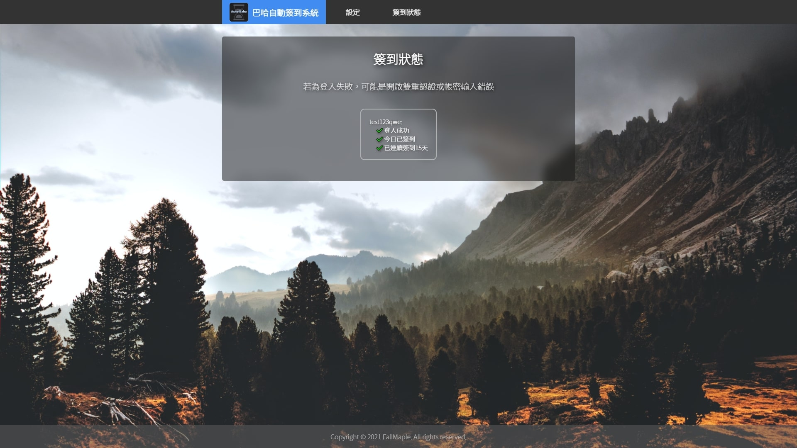
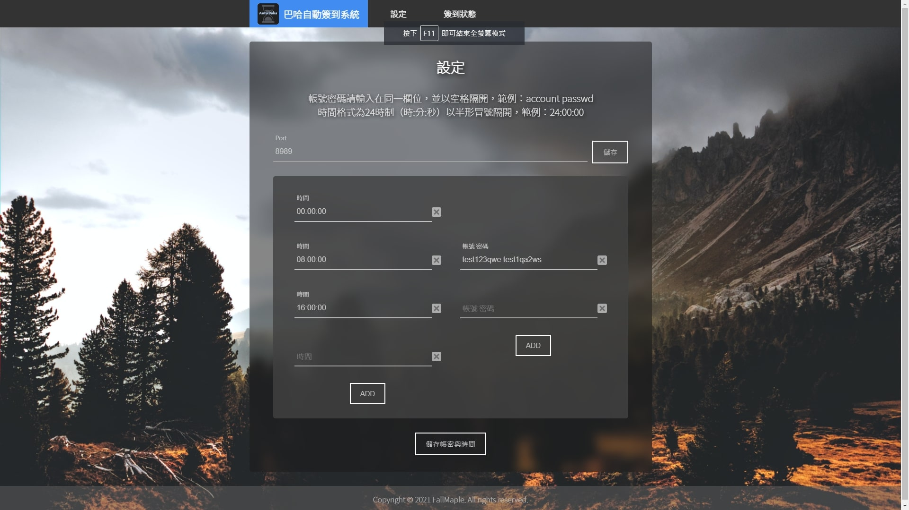

# 巴哈自動簽到GUI系統

此程式為使用先前我自己撰寫的巴哈爬蟲來定時自動簽到，並且增加網頁做前端操控，可單純使用 `python` 來運行，也可使用我用 `pyinstaller` 打包好的可執行檔直接執行<br>

+ 為避免避免隱私問題，使用本地執行
+ 可以後台執行+開機自動執行
+ 可以設定多個帳密
+ 可以設定多個時段
+ 設定好後就可以直接遺忘它的自動簽到系統

[windows 安裝檔使用教學](#)（不須布置任何環境 一鍵安裝）


## 目錄

## 運行方法

下載完整code後，執行以下指令

```
python3 app.py
```

此程式使用網頁端進行管理，開啟程式後預設開啟瀏覽器進入網頁<br>
也可自行輸入網址  [http://localhost:8989](http://localhost:8989) 或點擊此連結進入狀態頁面


## 設定與前端

### 開啟狀態頁面

此畫面會顯示所有儲存的帳號之簽到狀態<br>
只要是登入失敗，八九不離十是帳號密碼輸入錯誤，請重新輸入該組帳號密碼

### 開啟設定頁面

port為 `flask` 運行端口，預設為8989，若更改後會立即重啟網頁後端，若不懂怎麼做別亂改<br>
預設有一組帳號與三個時間段<br>
這組帳號是測試用的，可以登入<br>
時間段格式必須為：時:分:秒 (不建議更動)<br>
```
XX:XX:XX
```
帳密格式必須為：中間使用空格隔開<br>
```
帳號 密碼
```
需要更多欄位可以點選 `ADD` 增加欄位<br>
<br>
如果不需要的欄位只要空著，儲存後下次就會不見了<br>
修改好以後點擊儲存，會自動儲存並執行一次簽到爬蟲<br>


### 更改port

雖然想說這個奇怪的 `port` 要被占用的機率不高<br>
但真的被占用後，可以直接針對檔案進行更改<br>
port 運行值為資料夾中 port 檔案中的數字，預設為 `8989` ，若有衝突可更改後再次執行<br>
若 `flask` 順利執行後也可直接在網頁中進行更改

## 注意事項
```
若使用雙重認證便無法自動登入與簽到，請注意
```

在測試的時候，短時間內登入次數過多，巴哈好像會針對該組ip進行監控<br>
只要是該組ip的登入頁面請求都會多出google的圖形驗證<br>
這基本上是繞不過去的，也會導致無法登入與噴錯<br>
所以建議設定好帳密後就放著別管他，一天三次基本上不會出事<br>
<br>
若真的出事了，換ip可以解決<br>
使用浮動ip的只要重新連結應該就沒問題了<br>

## 技術細節

+ 使用 `python` 做為開發語言，利用網頁做為 GUI 介面
+ 後端使用 `flask` 框架
+ 改良了簽到與登入機制，登入後會將 `session` 存起來，下次簽到後會呼叫原先的 `session` 並確定登入狀態，以此避免過多次的登入

## 聲明

此程式無任何收集個資之目的，所有資料皆不會傳向非巴哈站方<br>
因開發者只有一人，無法太完整測試是否會有bug<br>
個人也同樣使用此程式進行簽到<br>
但若因此程式而漏簽，本人不對漏簽負責

## 版權聲明

採用 `GPL` 授權