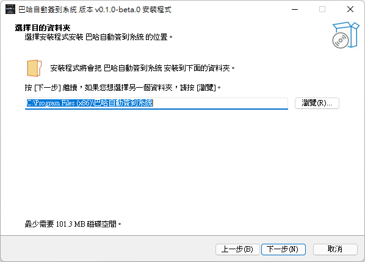
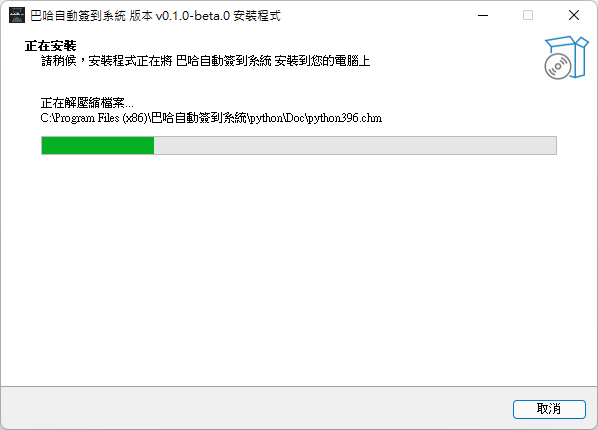

# Windows 一鍵安裝檔

將原始碼打包成安裝檔以方便使用

## 目錄
<!-- TOC -->

- [Windows 一鍵安裝檔](#windows-一鍵安裝檔)
  - [目錄](#目錄)
  - [安裝教學](#安裝教學)
  - [啟動程式](#啟動程式)
  - [打包狀況](#打包狀況)

<!-- /TOC -->

## 安裝教學

前往[release](https://github.com/tony53517230/baha_auto_signin_gui/releases)頁面下載最新版 `.exe` 安裝檔後執行，並根據引導進行安裝，下方為安裝流程示意圖

↑↑↑此語言僅限安裝流程時的語言，預設點擊確認就行  

↑↑↑選擇安裝資料夾，建議預設即可  

↑↑↑選擇是否開機自啟動與建立桌面圖示，建議開啟開機自啟動  

↑↑↑顯示準備安裝項目，點擊安裝  

↑↑↑等待安裝完成  

↑↑↑安裝完成後結束安裝，啟動設置介面  

## 啟動程式
請回到以下連結了解系統設定
[https://github.com/tony53517230/baha_auto_signin_gui](https://github.com/tony53517230/baha_auto_signin_gui)

## 打包狀況

原本是使用 `pyinstaller` 將程式直接編譯成 `.exe` 再打包，但由於使用 `pyinstaller` 編譯的檔案非常容易被掃毒判斷為木馬病毒，嘗試各種方法，只剩程式簽章還沒搞，但研究後發現太貴便放棄 

最後決定直接將 `python` 環境與相關模組直接塞進去，要運行的時候直接呼叫使用，因此最後檔案才會到 `100 MB` ，但也因此避免所有被判斷為病毒的可能性，也算是小小的偷懶吧，若是有人知道要怎麼改動可以不被是別為病毒，歡迎聯絡我或拉一個issue